# Coding Test Finplan 5.0

### Table Of Contents

- [Coding Test Finplan 5.0](#coding-test-finplan-50)
  - [Table Of Contents](#table-of-contents)
  - [Author](#author)
- [Documentation](#documentation)
- [Logic Test](#logic-test)
  - [How To Run?](#how-to-run)
  - [Screenshots](#screenshots)
- [Front End Test](#front-end-test)
  - [How To Run?](#how-to-run-1)
  - [Screenshots](#screenshots-1)

## Author

- [@nadiaalnd](https://github.com/nadiaalnd)
- Name : Nadila Aulya Salsabila Mirdianti
- Email : nadila2244@gmail.com | nadilaaulya.sm@gmail.com

# Documentation

# Logic Test

## How To Run?

- cd Logic-Test
- php `<name-file>`.php

## Screenshots

- Buat fungsi dengan menampilkan bilangan cacah kelipatan 3 atau 7 sebanyak N, serta menampilkan huruf Z saat bilangan tersebut kelipatan 3 dan 7.

  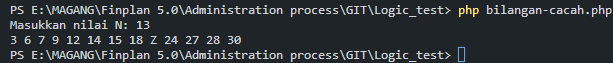

- Buat fungsi pencarian ‘sang gajah’, ‘serigala’, ‘harimau’.
  Dengan contoh masukan dan keluaran sebagai berikut

  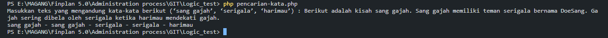

- Buatlah fungsi pengecekan kata sandi, dengan ketentuan sebagai

  - Kata sandi minimal 8 karakter
  - Kata sandi maksimal 32 karakter
  - Karakter awal tidak boleh angka
  - Harus memiliki angka
  - Harus memiliki huruf kapital dan huruf kecil

  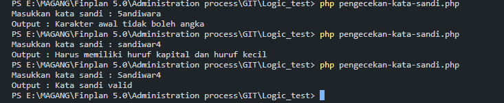

- Buat fungsi pengecekan bilangan cacah terkecil yang tidak ada dari data yang diinputkan. Dengan contoh input dan output sebagai berikut

  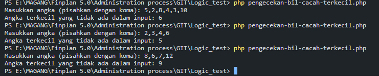

- Buat pola berikut sesuai inputan N, dengan N adalah bilangan ganjil

  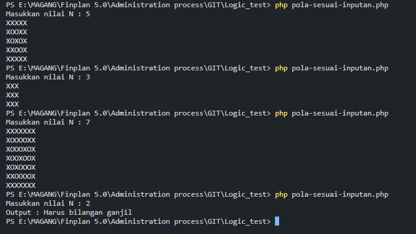

# Front End Test

## How To Run?

- cd Front End Test
- cd profile-app
- npm install
- npm run dev

## Screenshots

### Profil

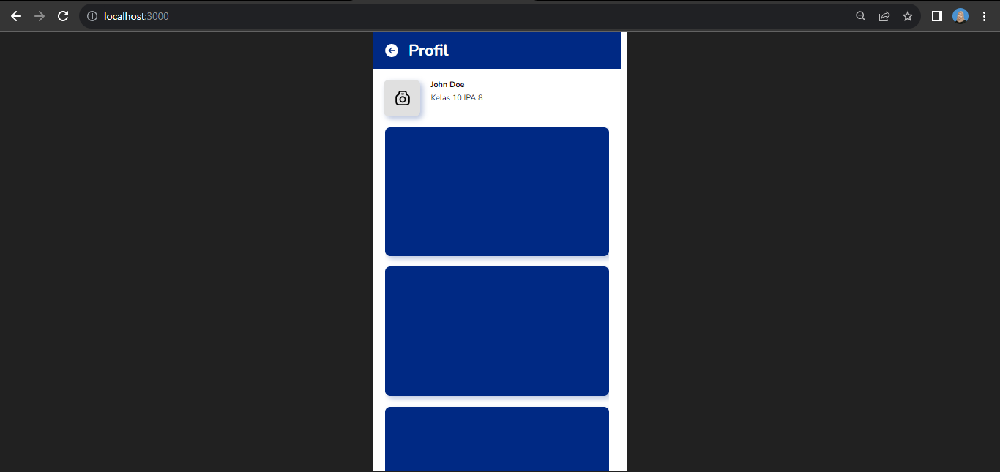

### Ganti Foto Profil

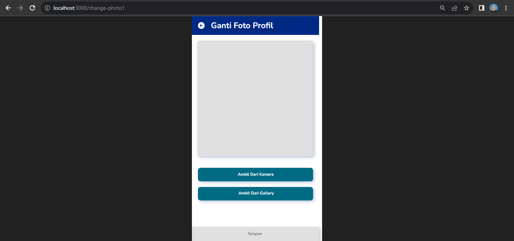

### Ambil Dari Kamera

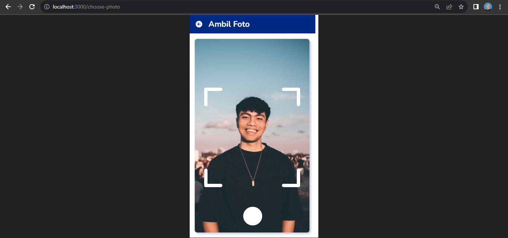

### Ambil Dari Gallery

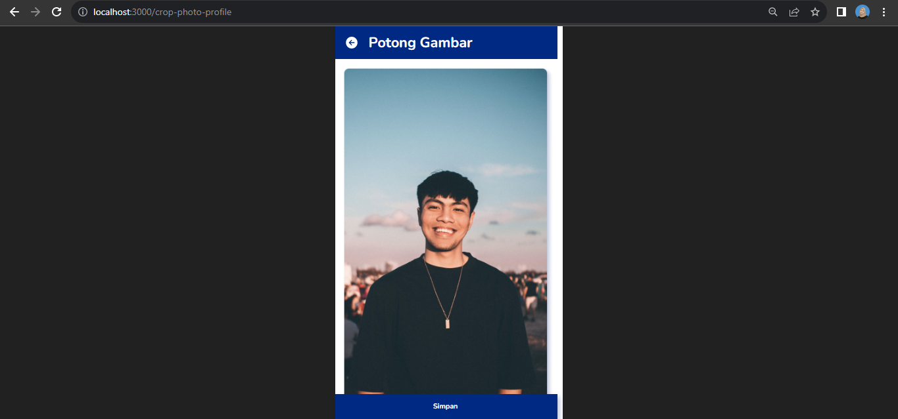

### Ambil Foto

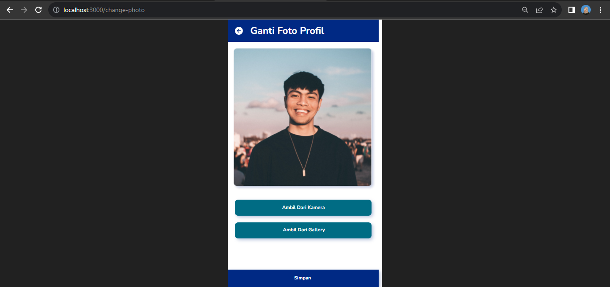

### Profil Terbaru

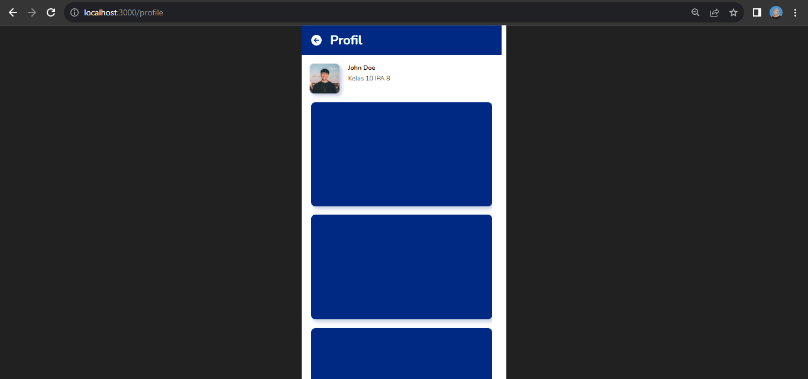
