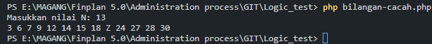
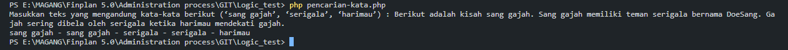
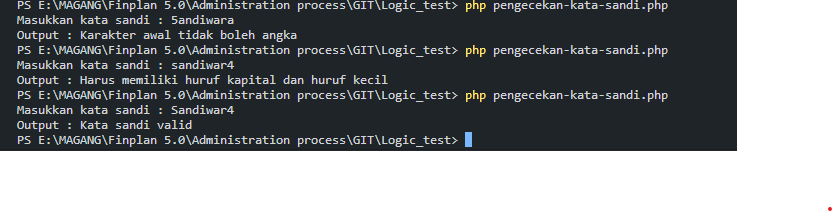
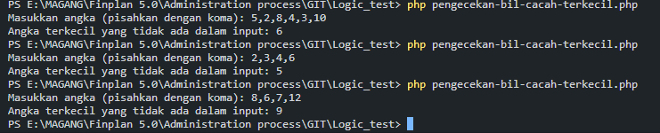
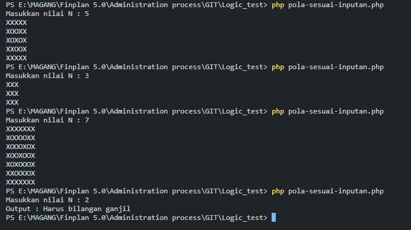

# Coding Test Finplan 5.0

### Table Of Contents

- [Author](#author)
- [Documentation](#documentation)
  - [Logical Test](#Logic-Test)
    - [How to run](#how-to-run)
    - [Screenshots](#screenshots)
  - [Front End Test](#front-end-test)

## Author

- [@nadiaalnd](https://github.com/nadiaalnd)

# Documentation

# Logic Test

## How To Run?

- cd Logic-Test
- php <name-file>.php

## Screenshots

- Buat fungsi dengan menampilkan bilangan cacah kelipatan 3 atau 7 sebanyak N, serta menampilkan huruf Z saat bilangan tersebut kelipatan 3 dan 7.

  

- Buat fungsi pencarian ‘sang gajah’, ‘serigala’, ‘harimau’.
  Dengan contoh masukan dan keluaran sebagai berikut

  

- Buatlah fungsi pengecekan kata sandi, dengan ketentuan sebagai

  - Kata sandi minimal 8 karakter
  - Kata sandi maksimal 32 karakter
  - Karakter awal tidak boleh angka
  - Harus memiliki angka
  - Harus memiliki huruf kapital dan huruf kecil

  

- Buat fungsi pengecekan bilangan cacah terkecil yang tidak ada dari data yang diinputkan. Dengan contoh input dan output sebagai berikut

  

- Buat pola berikut sesuai inputan N, dengan N adalah bilangan ganjil

  

# Front End Test

## How To Run?

- cd Front End Test
- <command here!>
